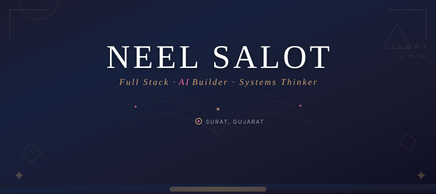
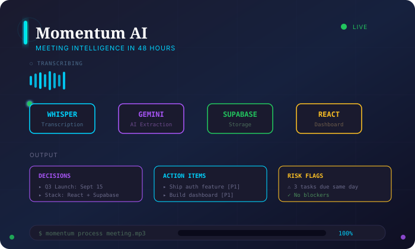
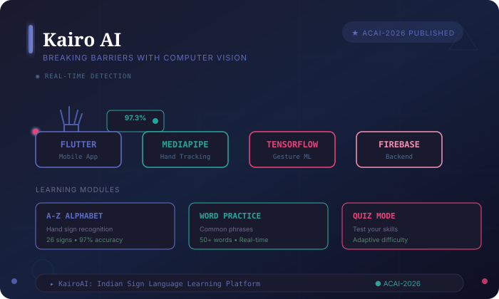
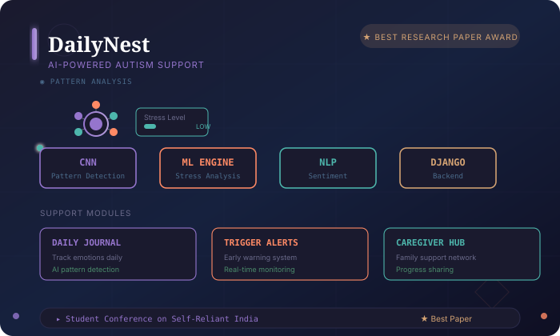

<!-- 
  ╔══════════════════════════════════════════════════════════════════╗
  ║  NEEL SALOT — The Renaissance Developer                         ║
  ║  Where Classical Craft Meets Modern Innovation                 ║
  ╚══════════════════════════════════════════════════════════════════╝
-->

<!-- HEADER: Bold dramatic hero with animated elements -->

  

---

## About

Building at the intersection of full-stack engineering and applied AI. Currently exploring how large language models can transform how teams collaborate, learn, and ship.

Three products shipped. Two research papers. One persistent obsession with making complex systems feel effortless.

---

## Selected Work

<!-- PROJECT 1: Momentum AI -->

  

**Momentum AI** — *Meeting Intelligence in 48 Hours*

Built at OceanLab × CHARUSAT Hackathon. An AI pipeline that transforms meeting audio into structured tasks, decisions, and risk flags.

`Whisper` → `Gemini` → `Supabase` → `React`

---

<!-- PROJECT 2: Kairo AI -->

  

**Kairo AI** — *Breaking Barriers with Computer Vision*

Published at ACAI-2026, National Conference on AI. Real-time gesture feedback using MediaPipe and TensorFlow Lite.

`Flutter` · `Firebase` · `MediaPipe` · `TensorFlow Lite`

---

<!-- PROJECT 3: DailyNest -->

  

**DailyNest** — *AI-Powered Autism Support*

Best Research Paper Award at Student Conference on Self-Reliant India. Multi-module system with AI pattern detection.

`Python` · `Django` · `CNN` · `ML` · `NLP`

---

## Experience

**Full Stack Developer Intern** — Swayam Tech *(Aug–Oct 2025)*

Built features across frontend and backend for GEMS enterprise platform.

---

## Education

**B.Sc. Information Technology** — Uka Tarsadia University, BMIIT Surat
- CGPA 9.46 · Academic Excellence Award *(2×)*

**Class XII** — R. D. Ghael Jeevan Bharti Kumar Bhavan
- 90.13%

---

## Research

- **KairoAI: Indian Sign Language Learning Platform** — *ACAI-2026, National Conference on AI*
- **AI-Powered All-in-One Life Aid for Autism Spectrum Disorder** — *Best Research Paper Award*

---

## Connect

<a href="https://github.com/Neel-Salot" style="display: inline-block; padding: 10px 20px; background: linear-gradient(135deg, #1a1a2e, #16213e); border: 1px solid #d4a373; border-radius: 8px; color: #d4a373; text-decoration: none; font-family: -apple-system, sans-serif; font-size: 14px; letter-spacing: 1px;">GitHub</a>

<a href="https://linkedin.com/in/neel-salot" style="display: inline-block; padding: 10px 20px; background: linear-gradient(135deg, #1a1a2e, #16213e); border: 1px solid #5c6bc0; border-radius: 8px; color: #5c6bc0; text-decoration: none; font-family: -apple-system, sans-serif; font-size: 14px; letter-spacing: 1px;">LinkedIn</a>

<a href="mailto:neelsalot.work@gmail.com" style="display: inline-block; padding: 10px 20px; background: linear-gradient(135deg, #1a1a2e, #16213e); border: 1px solid #ff6b9d; border-radius: 8px; color: #ff6b9d; text-decoration: none; font-family: -apple-system, sans-serif; font-size: 14px; letter-spacing: 1px;">Email</a>

---

  SURAT, GUJARAT · 2024

<!-- Animated accent at bottom -->

  <svg width="200" height="20" viewBox="0 0 200 20" xmlns="http://www.w3.org/2000/svg">
    <defs>
      <linearGradient id="footerGrad" x1="0%" y1="0%" x2="100%" y2="0%">
        <stop offset="0%" stop-color="#d4a373" stop-opacity="0"/>
        <stop offset="50%" stop-color="#d4a373" stop-opacity="0.5"/>
        <stop offset="100%" stop-color="#ff6b9d" stop-opacity="0"/>
      </linearGradient>
    </defs>
    <line x1="0" y1="10" x2="200" y2="10" stroke="url(#footerGrad)" stroke-width="1"/>
    <circle cx="100" cy="10" r="3" fill="#d4a373">
      <animate attributeName="cy" values="10;7;10" dur="2s" repeatCount="indefinite"/>
      <animate attributeName="fill" values="#d4a373;#ff6b9d;#d4a373" dur="4s" repeatCount="indefinite"/>
    </circle>
  </svg>

