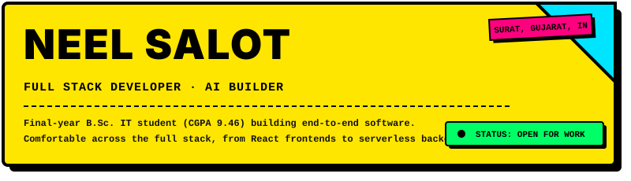
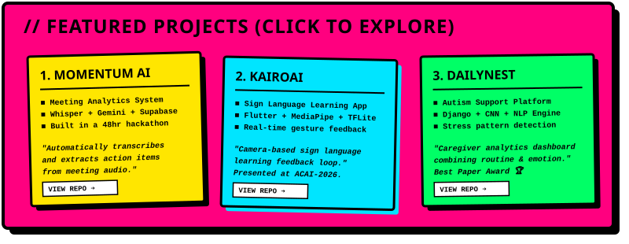
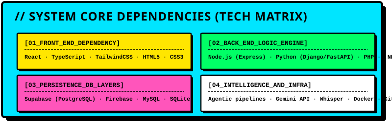
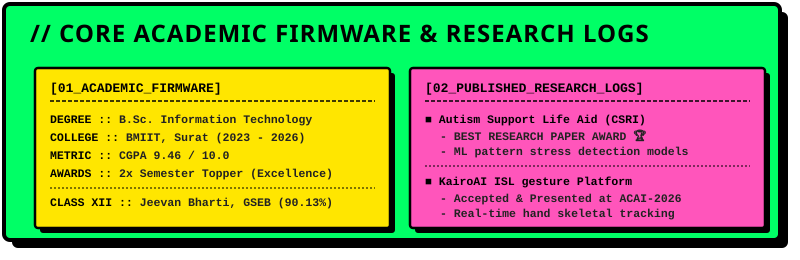

# 🌌 NEEL_SALOT // SYSTEMS_OPERATOR

  <!-- Introduction Header Card -->
  
    
  
  <!-- Clickable Projects Showcase Card -->
  
    
  
  <!-- Technical Skills dependency Card -->
  
    
  
  <!-- Academic Credentials & Research Logs Card -->
  

---

  

    <b>Operator Contact:</b> <a href="mailto:neelsalot.work@gmail.com">neelsalot.work@gmail.com</a> · <a href="https://linkedin.com/in/neel-salot" target="_blank" rel="noopener noreferrer">LinkedIn</a> · <a href="https://github.com/Neel-Salot" target="_blank" rel="noopener noreferrer">GitHub</a>
  

