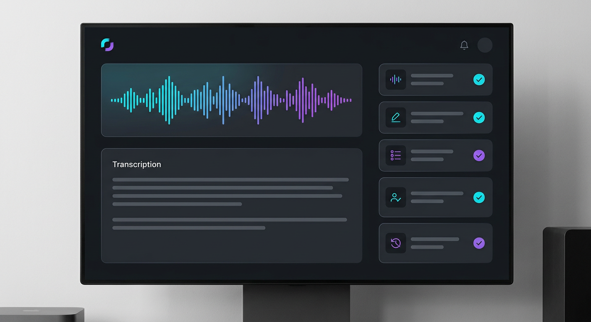
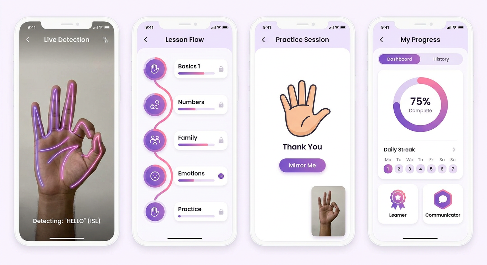
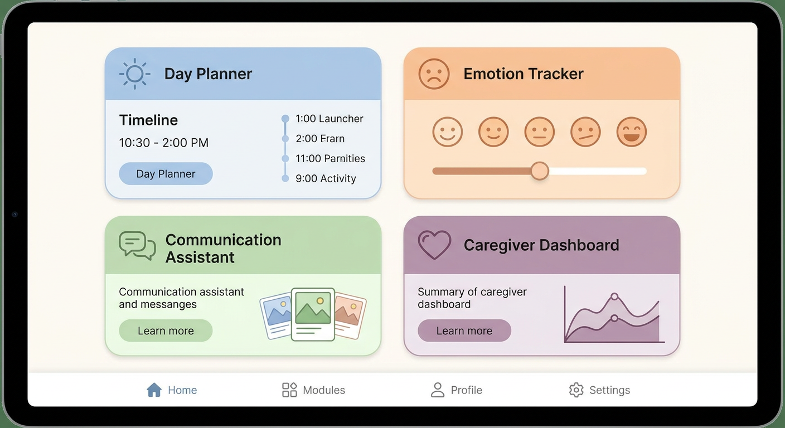

# NEEL SALOT

### Full Stack Developer · AI Builder · Systems Thinker

 

---

## Projects

### Momentum AI
Meeting Intelligence & Execution System

Built in 48 hours at OceanLab × CHARUSAT Hackathon. AI pipeline that ingests meeting audio and outputs structured tasks, decisions, and risk flags.

`Whisper → Gemini → Supabase → React Dashboard`

---

### Kairo AI
Indian Sign Language Learning Platform

Published at ACAI-2026, National Conference on AI. Real-time gesture feedback using MediaPipe and TensorFlow Lite.

`Flutter · Firebase · MediaPipe · TensorFlow Lite`

---

### DailyNest
AI Autism Support Platform

Best Research Paper Award at Student Conference on Self-Reliant India. Multi-module system with AI pattern detection for stress triggers.

`Python · Django · CNN · ML · NLP`

---

## Experience

**Full Stack Developer Intern** — Swayam Tech (Aug–Oct 2025)
Built features across frontend and backend for GEMS enterprise platform.

---

## Education

**B.Sc. Information Technology** — Uka Tarsadia University, BMIIT Surat
CGPA 9.46 · Academic Excellence Award (2x)

**Class XII** — R. D. Ghael Jeevan Bharti Kumar Bhavan
90.13%

---

## Research

- **KairoAI: Indian Sign Language Learning Platform** — ACAI-2026, National Conference on AI
- **AI-Powered All-in-One Life Aid for Autism Spectrum Disorder** — Best Research Paper Award, Student Conference on Self-Reliant India

---

## Connect

[github.com/Neel-Salot](https://github.com/Neel-Salot) · [linkedin.com/in/neel-salot](https://linkedin.com/in/neel-salot) · neelsalot.work@gmail.com
