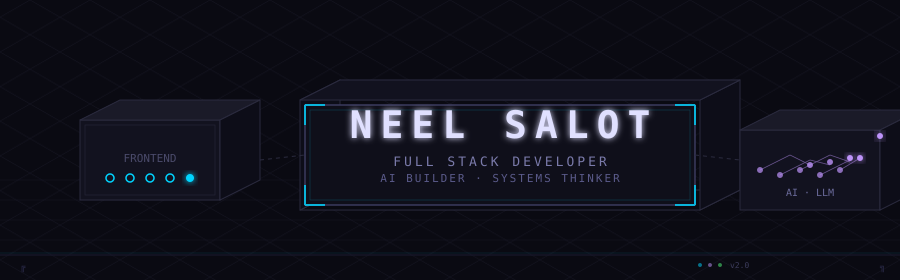
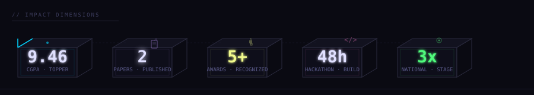
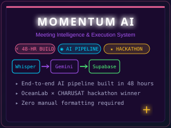
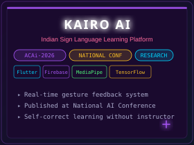
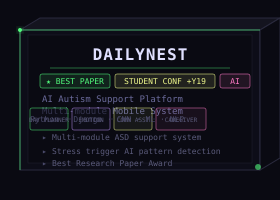

# NEEL SALOT // FULL STACK DEVELOPER · AI BUILDER · SYSTEMS THINKER

<div align="center">

<!-- ═══════════════════════════════════════════════════════════════════════ -->
<!-- ISOMETRIC GRID - 3D PERSPECTIVE STRUCTURAL HEADER                     -->
<!-- ═══════════════════════════════════════════════════════════════════════ -->

<a href="https://github.com/Neel-Salot" target="_blank">

</a>

<br><br>

<!-- ═══════════════════════════════════════════════════════════════════════ -->
<!-- IMPACT DIMENSIONS - 3D CUBE COMPOSITION                               -->
<!-- ═══════════════════════════════════════════════════════════════════════ -->

<a href="https://github.com/Neel-Salot" target="_blank">

</a>

<br><br>

<!-- ═══════════════════════════════════════════════════════════════════════ -->
<!-- PROJECTS - ISOMETRIC DISPLAY CASES                                    -->
<!-- ═══════════════════════════════════════════════════════════════════════ -->

<a href="https://github.com/yugamm15/momentum-ai" target="_blank">

</a>
&nbsp;
<a href="https://github.com/meghmodi2810/KairoAI" target="_blank">

</a>
&nbsp;
<a href="https://github.com/meghmodi2810/DailyNest" target="_blank">

</a>

<br><br>

<!-- ═══════════════════════════════════════════════════════════════════════ -->
<!-- TERMINAL OUTPUT - REAL PROJECT OUTPUT                                 -->
<!-- ═══════════════════════════════════════════════════════════════════════ -->

<details open>
<summary><b>⟨ OUTPUT: MOMENTUM AI ⟩</b></summary>

```momentum-ai
$ momentum process meeting-recording.mp3

  ◉ Transcribing audio...
    ██████████████████████ 100% — 00:47

  ◉ Extracting structured data...
    ██████████████████████ 100% — 00:12

  ◉ Generating action items...
    ██████████████████████ 100% — 00:03

  ─────────────────────────────────────────
  MEETING SUMMARY          48 min  |  3 speakers
  ─────────────────────────────────────────

  DECISIONS
    ↳ Q3 launch date confirmed: Sept 15
    ↳ Tech stack: React + Supabase + Gemini

  ACTION ITEMS
    ↳ @neel  — Ship auth module          [P1]
    ↳ @yugam  — Design dashboard         [P1]
    ↳ @megh   — Write API docs           [P2]

  RISK FLAGS
    ⚠ Timeline pressure: 3 tasks due same day
    ✓ No blockers detected

  ─────────────────────────────────────────
  Output: 3 tasks created | 2 decisions logged
  ─────────────────────────────────────────
```
</details>

<br>

<!-- ═══════════════════════════════════════════════════════════════════════ -->
<!-- TECH STACK - BLUEPRINT GRID                                           -->
<!-- ═══════════════════════════════════════════════════════════════════════ -->

<a href="https://github.com/Neel-Salot" target="_blank">

</a>

<br><br>

<!-- ═══════════════════════════════════════════════════════════════════════ -->
<!-- RESEARCH & EXPERIENCE - VERTICAL TIMELINE                             -->
<!-- ═══════════════════════════════════════════════════════════════════════ -->

<a href="https://github.com/Neel-Salot" target="_blank">

</a>

</div>

<br>

---

<div align="center">

<!-- ═══════════════════════════════════════════════════════════════════════ -->
<!-- CONTACT STRUCTURAL BAR                                                -->
<!-- ═══════════════════════════════════════════════════════════════════════ -->

```
╔══════════════════════════════════════════════════════════════╗
║  ◎  neelsalot.work@gmail.com                               ║
║  ⌂  github.com/Neel-Salot                                 ║
║  ◈  linkedin.com/in/neel-salot                             ║
║  ⬡  Surat, Gujarat                                         ║
╚══════════════════════════════════════════════════════════════╝
```

</div>
