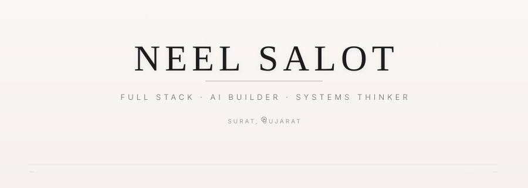
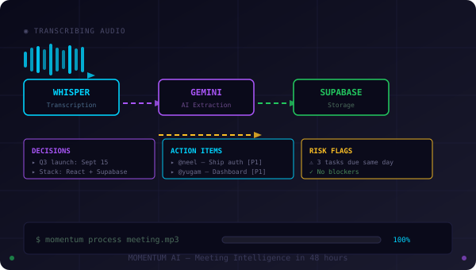
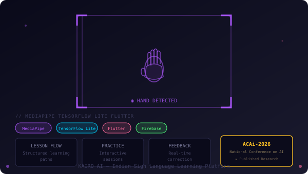
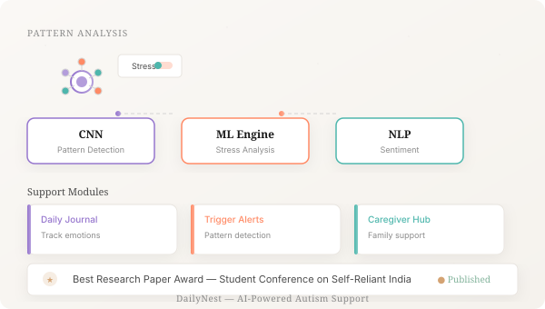

<!-- 
  ╔══════════════════════════════════════════════════════════════════╗
  ║  NEEL SALOT — Full Stack · AI Builder · Systems Thinker          ║
  ║  Surmounted in editorial minimalism ✦ Shopify Renaissance Edition ║
  ╚══════════════════════════════════════════════════════════════════╝
-->

<!-- HEADER: Editorial hero with animated line art -->

  

<!-- ABOUT: Clean editorial layout -->
<section align="center" style="max-width: 680px; margin: 60px auto; font-family: -apple-system, BlinkMacSystemFont, 'Segoe UI', sans-serif;">

### About

Building at the intersection of full-stack engineering and applied AI. Currently exploring how large language models can transform how teams collaborate, learn, and ship.

Three products shipped. Two research papers. One persistent obsession with making complex systems feel effortless.

</section>

<!-- ANIMATED DIVIDER: Elegant line with floating dot -->

  <svg width="200" height="20" viewBox="0 0 200 20" xmlns="http://www.w3.org/2000/svg">
    <defs>
      <linearGradient id="lineGrad" x1="0%" y1="0%" x2="100%" y2="0%">
        <stop offset="0%" stop-color="#1a1a1a" stop-opacity="0"/>
        <stop offset="50%" stop-color="#1a1a1a" stop-opacity="0.3"/>
        <stop offset="100%" stop-color="#1a1a1a" stop-opacity="0"/>
      </linearGradient>
    </defs>
    <line x1="0" y1="10" x2="200" y2="10" stroke="url(#lineGrad)" stroke-width="0.5"/>
    <circle cx="100" cy="10" r="3" fill="#1a1a1a" opacity="0.4">
      <animate attributeName="cy" values="10;8;10" dur="3s" repeatCount="indefinite"/>
      <animate attributeName="opacity" values="0.4;0.7;0.4" dur="3s" repeatCount="indefinite"/>
    </circle>
  </svg>

---

## Selected Work

<!-- PROJECT 1: Momentum AI with animated card -->

  

**Momentum AI** — *Meeting Intelligence & Execution System*

Built in 48 hours at OceanLab × CHARUSAT Hackathon. An AI pipeline that transforms meeting audio into structured tasks, decisions, and risk flags.

`Whisper` → `Gemini` → `Supabase` → `React`

---

<!-- PROJECT 2: Kairo AI with animated card -->

  

**Kairo AI** — *Indian Sign Language Learning Platform*

Published at ACAI-2026, National Conference on AI. Real-time gesture feedback using MediaPipe and TensorFlow Lite.

`Flutter` · `Firebase` · `MediaPipe` · `TensorFlow Lite`

---

<!-- PROJECT 3: DailyNest with animated card -->

  

**DailyNest** — *AI Autism Support Platform*

Best Research Paper Award at Student Conference on Self-Reliant India. Multi-module system with AI pattern detection for stress triggers.

`Python` · `Django` · `CNN` · `ML` · `NLP`

---

## Experience

**Full Stack Developer Intern** — Swayam Tech *(Aug–Oct 2025)*

Built features across frontend and backend for GEMS enterprise platform.

---

## Education

**B.Sc. Information Technology** — Uka Tarsadia University, BMIIT Surat
- CGPA 9.46 · Academic Excellence Award *(2×)*

**Class XII** — R. D. Ghael Jeevan Bharti Kumar Bhavan
- 90.13%

---

<!-- ANIMATED DIVIDER 2 -->

  <svg width="200" height="20" viewBox="0 0 200 20" xmlns="http://www.w3.org/2000/svg">
    <line x1="0" y1="10" x2="200" y2="10" stroke="url(#lineGrad)" stroke-width="0.5"/>
    <rect x="97" y="7" width="6" height="6" fill="#1a1a1a" opacity="0.4" rx="1">
      <animateTransform attributeName="transform" type="rotate" from="0 100 10" to="360 100 10" dur="8s" repeatCount="indefinite"/>
    </rect>
  </svg>

## Research

- **KairoAI: Indian Sign Language Learning Platform** — ACAI-2026, National Conference on AI
- **AI-Powered All-in-One Life Aid for Autism Spectrum Disorder** — Best Research Paper Award, Student Conference on Self-Reliant India

---

<!-- CONNECT: Clean editorial footer -->

  
  <a href="https://github.com/Neel-Salot" style="color: #1a1a1a; text-decoration: none; border-bottom: 1px solid #e0e0e0; padding-bottom: 2px;">GitHub</a>
  · 
  <a href="https://linkedin.com/in/neel-salot" style="color: #1a1a1a; text-decoration: none; border-bottom: 1px solid #e0e0e0; padding-bottom: 2px;">LinkedIn</a>
  · 
  <a href="mailto:neelsalot.work@gmail.com" style="color: #1a1a1a; text-decoration: none; border-bottom: 1px solid #e0e0e0; padding-bottom: 2px;">Email</a>

<!-- Subtle footer with location and year -->

  Surat, Gujarat · 2024

