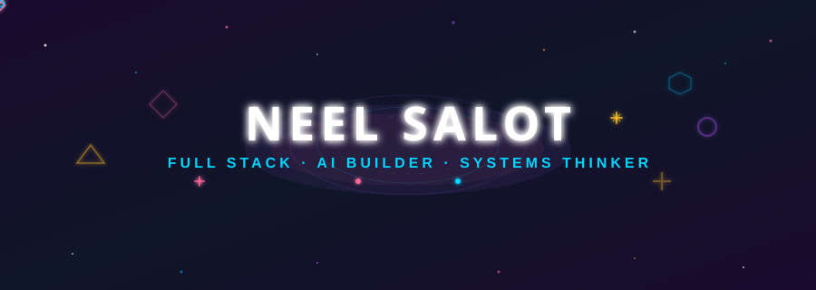

# NEEL SALOT

<div align="center">

<!-- ═══════════════════════════════════════════════════════════════ -->
<!-- COSMIC HERO - animated floating particles, orbitals, stars  -->
<!-- ═══════════════════════════════════════════════════════════════ -->

<a href="https://github.com/Neel-Salot" target="_blank">

</a>

<br><br>

<!-- ═══════════════════════════════════════════════════════════════ -->
<!-- FUN INTRO - who even is this person                        -->
<!-- ═══════════════════════════════════════════════════════════════ -->

```
╔══════════════════════════════════════════════════════════════════════╗
║                                                                      ║
║   final year B.Sc. IT student (CGPA 9.46 🏆)                        ║
║   who builds things from AI pipelines at hackathons                  ║
║   to systems at national conferences                                 ║
║                                                                      ║
║   comfortable across the full stack                                  ║
║   drawn to ambiguous problems                                       ║
║   and products that actually get used                               ║
║                                                                      ║
╚══════════════════════════════════════════════════════════════════════╝
```

<br><br>

<!-- ═══════════════════════════════════════════════════════════════ -->
<!-- PROJECTS - display case style                                  -->
<!-- ═══════════════════════════════════════════════════════════════ -->

<a href="https://github.com/yugamm15/momentum-ai" target="_blank">

</a>
&nbsp;
<a href="https://github.com/meghmodi2810/KairoAI" target="_blank">

</a>
&nbsp;
<a href="https://github.com/meghmodi2810/DailyNest" target="_blank">

</a>

<br><br>

<!-- ═══════════════════════════════════════════════════════════════ -->
<!-- REAL OUTPUT - this is what the code actually does             -->
<!-- ═══════════════════════════════════════════════════════════════ -->

```momentum-ai
$ momentum process meeting-recording.mp3

  ◉ Transcribing audio...
    ██████████████████████ 100% — 00:47

  ◉ Extracting structured data...
    ██████████████████████ 100% — 00:12

  ◉ Generating action items...
    ██████████████████████ 100% — 00:03

  ─────────────────────────────────────────
  MEETING SUMMARY          48 min  |  3 speakers
  ─────────────────────────────────────────

  DECISIONS
    ↳ Q3 launch date confirmed: Sept 15
    ↳ Tech stack: React + Supabase + Gemini

  ACTION ITEMS
    ↳ @neel  — Ship auth module          [P1]
    ↳ @yugam  — Design dashboard         [P1]
    ↳ @megh   — Write API docs           [P2]

  RISK FLAGS
    ⚠ Timeline pressure: 3 tasks due same day
    ✓ No blockers detected

  ─────────────────────────────────────────
  Output: 3 tasks created | 2 decisions logged
  ─────────────────────────────────────────
```

<br><br>

<!-- ═══════════════════════════════════════════════════════════════ -->
<!-- STACK - clean organized sections                             -->
<!-- ═══════════════════════════════════════════════════════════════ -->

```
╔═══════════════════════════════════════════════════════════════════╗
║                                                                   ║
║   FRONTEND ────────── React · TypeScript · JavaScript · CSS      ║
║                                                                   ║
║   AI & LLMs ──────── Agentic AI · Gemini · Whisper · LLM Int.    ║
║                                                                   ║
║   BACKEND ────────── Node.js · Python · PHP · .NET               ║
║                                                                   ║
║   MOBILE ─────────── Flutter · Kotlin · TensorFlow Lite          ║
║                                                                   ║
║   DATABASE ───────── MySQL · Firebase · Supabase                  ║
║                                                                   ║
║   TOOLS ──────────── GitHub · Jira                               ║
║                                                                   ║
╚═══════════════════════════════════════════════════════════════════╝
```

<br><br>

<!-- ═══════════════════════════════════════════════════════════════ -->
<!-- EXPERIENCE                                                  -->
<!-- ═══════════════════════════════════════════════════════════════ -->

```
╔═══════════════════════════════════════════════════════════════════╗
║                                                                   ║
║   AUG–OCT 2025 ──── Full Stack Developer Intern                   ║
║                      Swayam Tech · Remote · GEMS platform          ║
║                                                                   ║
║   JAN 2026 ──────── KairoAI published at ACAi-2026                ║
║                      National Conference on AI                     ║
║                                                                   ║
║   2025 ──────────── DailyNest won Best Research Paper             ║
║                      Student Conf on Self-Reliant India            ║
║                                                                   ║
╚═══════════════════════════════════════════════════════════════════╝
```

<br><br>

<!-- ═══════════════════════════════════════════════════════════════ -->
<!-- EDUCATION                                                   -->
<!-- ═══════════════════════════════════════════════════════════════ -->

```
╔═══════════════════════════════════════════════════════════════════╗
║                                                                   ║
║   B.Sc. IT ──────────────────────────────────── CGPA 9.46         ║
║   Uka Tarsadia University · BMIIT, Surat ──── Academic            ║
║                                             Excellence Award (2x)  ║
║                                                                   ║
║   Class XII ─────────────────────────────────── 90.13%            ║
║   R. D. Ghael Jeevan Bharti Kumar Bhavan ──── GHSEB              ║
║                                                                   ║
╚═══════════════════════════════════════════════════════════════════╝
```

</div>

---

<div align="center">

<!-- ═══════════════════════════════════════════════════════════════ -->
<!-- CONNECT                                                     -->
<!-- ═══════════════════════════════════════════════════════════════ -->

```
  ◎  neelsalot.work@gmail.com
  ◎  github.com/Neel-Salot
  ◎  linkedin.com/in/neel-salot
  ◎  Surat, Gujarat
```

</div>
