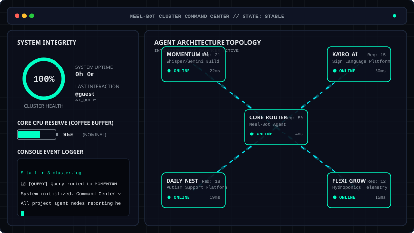

# 🌌 NEEL SALOT
### Full Stack Developer · AI Builder · Systems Thinker
Surat, Gujarat, India 🇮🇳 (GMT+5:30)

```
========================================================================
[SYSTEM LOG] Initializing Neel-Bot Agent Environment...
[SYSTEM LOG] Status: ACTIVE | Current Time: Surat (GMT+5:30)
[SYSTEM LOG] Core Focus: Systems Thinking & Agentic AI Pipelines
========================================================================
```

<picture>
  <source media="(prefers-color-scheme: dark)" srcset="assets/header-dark.svg">
  <source media="(prefers-color-scheme: light)" srcset="assets/header-light.svg">
  
</picture>

---

## 🤖 Neel's Autonomous Agent Cluster Dashboard

Welcome to the autonomous dashboard monitoring Neel's projects. This profile runs an active **multiplayer state machine simulator** powered by GitHub Actions and the **Gemini API**. You can interact with this infrastructure in real-time!

<div align="center">
  <picture>
    <source media="(prefers-color-scheme: dark)" srcset="assets/console.svg">
    <source media="(prefers-color-scheme: light)" srcset="assets/console-light.svg">
    
  </picture>

  <p>
    <b>Cooperate or disrupt! Choose an action below to dispatch a job:</b>
  </p>

  <a href="https://github.com/Neel-Salot/Neel-Salot/issues/new?assignees=&labels=neel-bot&projects=&template=ask-neel-bot.yml&title=%F0%9F%A7%A0+Ask+Neel-Bot%3A+%5BYour+Question+Here%5D">
    
  </a>
  &nbsp;
  <a href="https://github.com/Neel-Salot/Neel-Salot/issues/new?assignees=&labels=neel-bot,coffee&projects=&template=buy-coffee.yml&title=%E2%98%95%EF%B8%8F+Buy+Neel+a+Virtual+Coffee+from+%5BYour+Name%5D">
    
  </a>
  &nbsp;
  <a href="https://github.com/Neel-Salot/Neel-Salot/issues/new?assignees=&labels=neel-bot,chaos&projects=&template=chaos-monkey.yml&title=%F0%9F%90%B5+Release+Chaos+Monkey+on+the+Profile">
    
  </a>
  &nbsp;
  <a href="https://github.com/Neel-Salot/Neel-Salot/issues/new?assignees=&labels=neel-bot,patch&projects=&template=run-patch.yml&title=%F0%9F%94%A7+Run+Self-Healing+Patch+on+Agent+Cluster">
    
  </a>
</div>

### 📊 Real-Time Node Status Grid
<!-- START_CLUSTER_GRID -->

| Node / System | Function | Status | Load/Mem | Response Time |
| :--- | :--- | :--- | :--- | :--- |
| **CORE_ROUTER** | Central Command Router | 🟢 `ONLINE` | `46%` | `14ms` |
| **MOMENTUM_AI** | Meeting Execution Pipeline | 🟢 `ONLINE` | `60%` | `22ms` |
| **KAIRO_AI** | Sign Language Learning | 🟢 `ONLINE` | `51%` | `30ms` |
| **DAILY_NEST** | Autism Support Platform | 🟢 `ONLINE` | `42%` | `19ms` |
| **FLEXI_GROW** | Hydroponics Telemetry | 🟢 `ONLINE` | `36%` | `15ms` |

<!-- END_CLUSTER_GRID -->

### 📜 Live Console Output & Guestbook Logs
<!-- START_NEEL_BOT_LOG -->
```
[2026-06-04 03:58] 💬 [QUERY] Query routed to MOMENTUM node by @guest.
[2026-06-04 03:58] System initialized. Command Center v2.0 is ready.
[2026-06-04 03:58] All project agent nodes reporting healthy status.
```
<!-- END_NEEL_BOT_LOG -->

---

## ⚡ Hackathons & Featured Builds
I build end-to-end, multi-module systems, often within tight hackathon deadlines.

### 🧠 Momentum AI · [GitHub](https://github.com/yugamm15/momentum-ai)
> **Meeting Intelligence & Execution System** | *48-hr build at OceanLab × CHARUSAT Hackathon, April 2026*
* **What it is**: An autonomous pipeline that ingests audio, transcribes it, extracts structured action items, and syncs them to task trackers.
* **Architecture**: Whisper (transcription) ➔ Gemini (structured extraction) ➔ Supabase DB ➔ serverless APIs ➔ React dashboard.
* **Key Feature**: Custom fallback persistence layer ensuring zero data loss during network or AI failures.

### 🤟 KairoAI · [GitHub](https://github.com/meghmodi2810/KairoAI) · [Live Demo](https://kairo-ai-website-nu.vercel.app/)
> **Indian Sign Language Learning Platform** | *Research presented at ACAI-2026*
* **What it is**: An AI-assisted platform enabling self-guided learning of sign language with real-time feedback.
* **Architecture**: Flutter (mobile) ➔ MediaPipe & TF Lite (on-device gesture extraction) ➔ Python/Kotlin.
* **Key Feature**: On-device gesture classification loop providing immediate correction to users without server latency.

### 🏡 DailyNest · [GitHub](https://github.com/meghmodi2810/DailyNest)
> **AI-Powered Autism Support Platform** | *Best Research Paper Award — CSRI*
* **What it is**: A multi-module assistant supporting individuals with ASD in schedules, regulation, and caregiver analytics.
* **Architecture**: Django ➔ CNN (expression classification) ➔ NLP analysis.
* **Key Feature**: AI pattern detection engine surfacing stress triggers from historical routine logs and suggesting pre-emptive calming routines.

---

## 🔬 Research & Publications
* **An AI-Powered All-in-One Life Aid for Autism Spectrum Disorder**
  * *Student Conference on Self-Reliant India (CSRI)* | **Best Research Paper Award** 🏆
* **KairoAI: Indian Sign Language Learning Platform**
  * *National Conference on Advance Computing and Artificial Intelligence (ACAI-2026)*

---

## 🛠️ The Tech Grid
```
  ┌──────────────────────────────────────────────────────────┐
  │ FRONTEND       │ React, TypeScript, TailwindCSS, CSS3    │
  ├────────────────┼─────────────────────────────────────────┤
  │ BACKEND & APIs │ Node.js, PHP, Python, .NET Core         │
  ├────────────────┼─────────────────────────────────────────┤
  │ INTELLIGENCE   │ Agentic AI pipelines, Gemini, Whisper   │
  ├────────────────┼─────────────────────────────────────────┤
  │ DATA STORAGE   │ Supabase, Firebase, MySQL, PostgreSQL    │
  ├────────────────┼─────────────────────────────────────────┤
  │ INFRA & TOOLS  │ Git, GitHub Actions, Jira, Docker       │
  └──────────────────────────────────────────────────────────┘
```

---

## 🎓 Education & Stats
* **B.Sc. Information Technology** (CGPA: 9.46) | *Babu Madhav Institute of IT (Surat)*
  * Academic Excellence Award (2× Semester Topper) 🥇
* **Hackathon Accomplishments**:
  * **OceanLab × CHARUSAT Hackathon (2026)**: Shipped *Momentum AI* in 48 hrs.
  * **Techotsav 2026**: Tech Icon Award, Team Debugging Doraemons.

---

<div align="center">
  <p>
    Email: <b>neelsalot.work@gmail.com</b> · LinkedIn: <b><a href="https://linkedin.com/in/neel-salot">neel-salot</a></b>
  </p>
</div>
