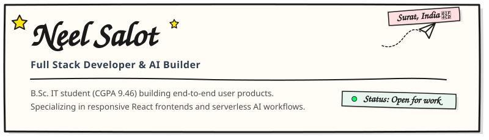
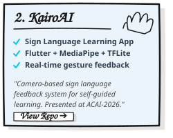
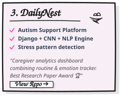
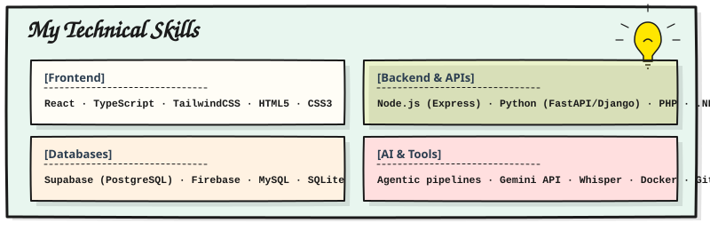
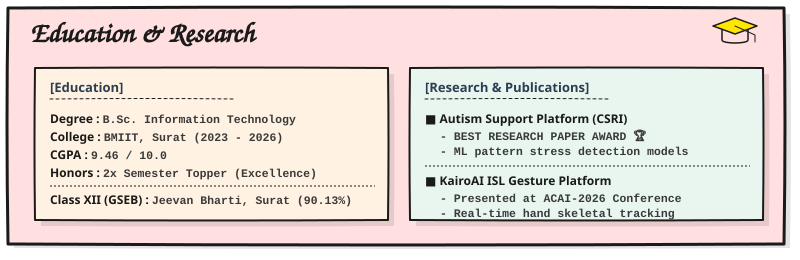

# 🌌 NEEL SALOT // FULL STACK DEVELOPER & AI BUILDER

  <!-- Introduction Header Card (Links to LinkedIn) -->
  
    
  
  <!-- Clickable Projects Showcase Grid (Each card links directly to its respective repo) -->
  
  &nbsp;
  
  &nbsp;
  
    
  
  <!-- Technical Skills Card (Links to GitHub) -->
  
    
  
  <!-- Academic Credentials & Research Card (Links to LinkedIn) -->
  

---

  

    <b>Contact:</b> <a href="mailto:neelsalot.work@gmail.com">neelsalot.work@gmail.com</a> · <a href="https://linkedin.com/in/neel-salot" target="_blank" rel="noopener noreferrer">LinkedIn</a> · <a href="https://github.com/Neel-Salot" target="_blank" rel="noopener noreferrer">GitHub</a>
  

